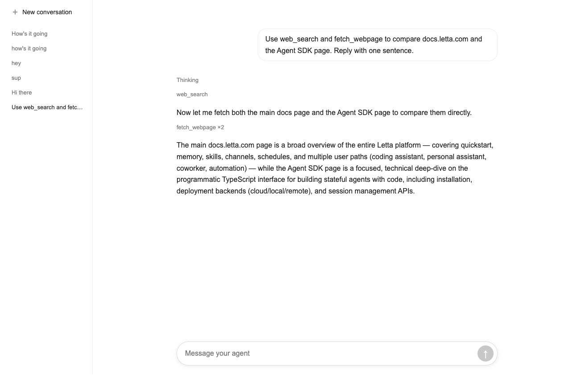

# Letta Agent SDK React chat

This project is a small, complete chat interface for one persistent Letta
agent. It demonstrates conversation switching, state restoration, streamed
Markdown, reasoning, tool calls, and stable follow-at-bottom behavior.



## Run the project

You need Node.js 22.19 or newer and a
[Letta API key](https://platform.letta.com/api-keys).

1. Install the dependencies:

   ```bash
   npm install
   ```

2. Create the local environment file:

   ```bash
   cp .env.example .env.local
   ```

3. Replace `your-key-here` in `.env.local` with your API key. Remove the sample
   `LETTA_CHAT_AGENT_ID` line.

4. Create the persistent demo agent:

   ```bash
   node --env-file=.env.local scripts/create-agent.mjs
   ```

   The script adds `LETTA_CHAT_AGENT_ID` to `.env.local`.

5. Start the development server:

   ```bash
   npm run dev
   ```

6. Open [http://localhost:3000](http://localhost:3000). Send this message:

   ```text
   Use web_search to find the Letta documentation homepage and reply with only its title.
   ```

The message passes when the page shows `web_search` followed by the answer.
Reload the page to verify that the complete transcript returns.

## Find the correct file

| Change                              | Start here                                |
| ----------------------------------- | ----------------------------------------- |
| Colors, spacing, width, or radii    | `styles/tokens.css`                       |
| Layout and responsive behavior      | `styles/chat.module.css`                  |
| User and assistant message markup   | `components/chat/transcript-message.tsx`  |
| Tool call display                   | `components/chat/tool-disclosure.tsx`     |
| Reasoning display                   | `components/chat/thinking-disclosure.tsx` |
| Composer display and loading state  | `components/chat/chat-composer.tsx`       |
| Browser conversation state          | `hooks/use-chat-session.ts`               |
| Follow-at-bottom behavior           | `hooks/use-follow-output.ts`              |
| Live event ordering                 | `lib/letta/browser-events.ts`             |
| Persisted history projection        | `lib/letta/transcript.ts`                 |
| Agent SDK session lifecycle         | `app/api/chat/route.ts`                   |
| Conversation creation and bootstrap | `app/api/conversations/route.ts`          |

Read [Customize the chat](docs/CUSTOMIZE.md) for guided interface changes. Read
[Architecture](docs/ARCHITECTURE.md) before you change the Agent SDK or
transcript state.

## Verify a change

Run all local checks:

```bash
npm run verify
```

The tests use deterministic event fixtures. They do not call Letta Cloud. Run
the manual tool-use message after changes to the API routes or session flow.

## Security boundary

The browser never receives `LETTA_API_KEY`. It receives projected tool names,
arguments, and status, but it does not receive raw tool-return content.

This example assumes one trusted user. Before deployment, authenticate every
request, add rate limits, and store the conversation IDs that each user can
access. Do not expose one agent's complete conversation list to unrelated
users.
